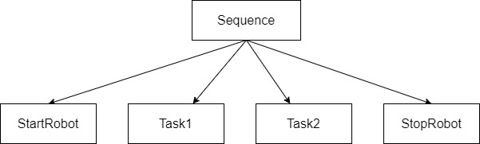

# BehaviorTree.CPP: Basic Concepts

## Overview

Welcome to the BehaviorTree.CPP Demos! Before we dive into specific examples, let's understand the basic concepts of behavior trees and how BehaviorTree.CPP works.

BehaviorTree.CPP is a powerful and flexible behavior tree library for C++. Before diving into the specifics of the library, it's important to understand some basic concepts related to behavior trees.

## What is a Behavior Tree?

A Behavior Tree is a graphical model used to represent the behavior of entities in a structured and modular way. It is commonly used in robotics, artificial intelligence, and game development to define the decision-making process of agents.

Behavior Trees consist of nodes that represent different behaviors, conditions, and control flow. These nodes can be organized hierarchically to create complex and flexible behavior patterns.

## Key Components
1. Node Types:
    - Action Nodes: Perform specific tasks or actions.
    - Condition Nodes: Check specific conditions.
    - Composite Nodes: Control the flow of execution.
    - Decorator Nodes: Modify or conditionally execute the child node.
2. Control Flow:
    - Sequence: Executes child nodes in sequential order until one fails.
    - Selector: Executes child nodes in order until one succeeds.
    - Parallel: Executes child nodes concurrently.
3. Blackboard:
    - Shared data storage where nodes can read or write information.
Let's expand on some of these concepts.

## Basic Concepts
### 1. Nodes
Behavior Trees consist of nodes, which are the building blocks of behavior. There are different types of nodes, each serving a specific purpose:

- **Root Node**: The entry point of the behavior tree.
- **Composite Nodes**: Nodes that contain other nodes and define how their children should be executed. Examples include sequence, selector, and parallel nodes.
- **Decorator Nodes**: Nodes that modify the behavior of their child nodes in some way, such as inverting their result or executing them conditionally.
- **Action Nodes**: Nodes that perform specific actions or behaviors.

### 2. Control Flow
The control flow of a behavior tree is determined by the type of composite nodes used and their configurations. The most common control flow patterns include sequential execution, parallel execution, and conditional branching.

### 3. Execution Model
Behavior Trees typically use a **tick-based** execution model, where the tree is traversed from the root node down to the leaf nodes during each tick. Nodes return a status code indicating the result of their execution (e.g., success, failure, running), which influences the behavior of their parent nodes.

### 4. Node Status
Nodes in a behavior tree can have one of the following statuses:

- **Success**: The node has completed its task successfully.
- **Failure**: The node has failed to complete its task.
- **Running**: The node is still in progress and needs more time to complete its task.

## BehaviorTree.CPP Library
BehaviorTree.CPP is a C++ library that provides a framework for creating and executing behavior trees. It includes a set of predefined node types and a flexible architecture for custom nodes.

## Resources
- [BT.CPP docs](https://www.behaviortree.dev/docs/intro).
- [Introduction to Behavior Trees (Article)](https://roboticseabass.com/2021/05/08/introduction-to-behavior-trees).
- [Behavior Trees in Robotics and AI: An Introduction (An amazing book about BTs)](https://arxiv.org/abs/1709.00084).